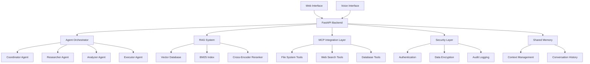
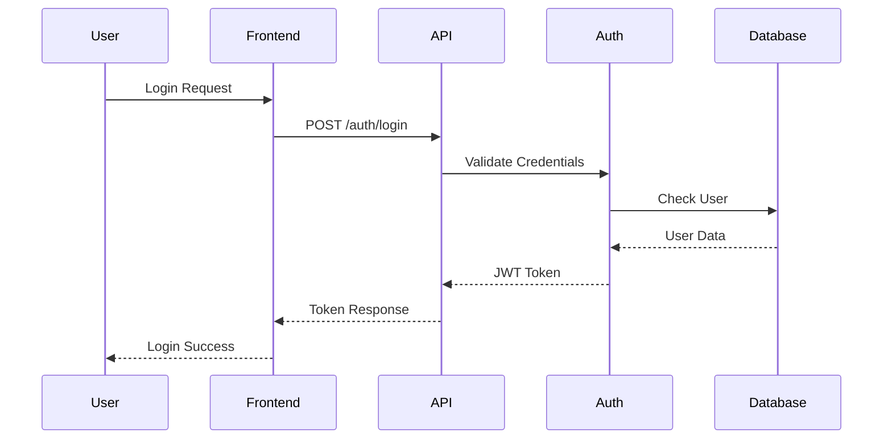

# Design Document

## Overview

The Agentic Research Copilot is a sophisticated multi-agent AI system that combines research assistance with developer copilot capabilities. The system leverages Model Context Protocol (MCP) for standardized tool access, implements retrieval-augmented generation (RAG) with hybrid search, and provides both web and voice interfaces for natural interaction.

## Architecture

### High-Level Architecture



### System Components

#### 1. Multi-Agent System
- **Agent Orchestrator**: Manages agent lifecycle and communication
- **Coordinator Agent**: Task decomposition and workflow management
- **Researcher Agent**: Information retrieval and web search
- **Analyzer Agent**: Evidence validation and insight clustering
- **Executor Agent**: Output formatting and code generation

#### 2. RAG System
- **Document Processor**: Text chunking and preprocessing
- **Hybrid Retriever**: Vector + BM25 search combination
- **Vector Store**: FAISS-based similarity search
- **Reranker**: Cross-encoder for relevance scoring
- **Citation Engine**: Source tracking and confidence scoring

#### 3. MCP Integration Layer
- **Tool Registry**: Centralized tool management
- **File System Tools**: Secure file operations
- **Web Search Tools**: External API integration
- **Database Tools**: Structured data access
- **Validation Engine**: Input/output validation

#### 4. Security Framework
- **Authentication Service**: JWT-based user authentication
- **Authorization System**: Role-based access control (RBAC)
- **Encryption Service**: Data encryption at rest and in transit
- **Audit Logger**: Comprehensive security logging

#### 5. Voice Interface
- **Speech-to-Text Service**: Real-time transcription
- **Text-to-Speech Service**: Neural voice synthesis
- **Voice Activity Detection**: Smart audio processing
- **Barge-in Support**: Interrupt handling

#### 6. Developer Copilot
- **Repository Analyzer**: Code structure analysis
- **Diff Generator**: Code change proposals
- **PR Drafter**: Pull request automation
- **Test Generator**: Unit test suggestions

## Components and Interfaces

### Agent Communication Protocol

```python
@dataclass
class AgentMessage:
    sender: str
    recipient: str
    message_type: MessageType
    content: Any
    timestamp: datetime
    correlation_id: str
```

### Memory Management

```python
class SharedMemory:
    def store_conversation(self, message: Message) -> None
    def get_context(self, max_tokens: int) -> List[Message]
    def compress_context(self) -> None
    def get_agent_context(self, agent_id: str) -> AgentContext
```

### RAG Interface

```python
class HybridRetriever:
    def retrieve(self, query: str, top_k: int = 10) -> List[Document]
    def rerank(self, query: str, documents: List[Document]) -> List[Document]
    def extract_citations(self, documents: List[Document]) -> List[Citation]
```

### MCP Tool Interface

```python
class MCPTool(ABC):
    @abstractmethod
    async def execute(self, params: Dict[str, Any]) -> ToolResult
    
    @abstractmethod
    def validate_input(self, params: Dict[str, Any]) -> bool
    
    @abstractmethod
    def get_schema(self) -> Dict[str, Any]
```

## Data Models

### Core Data Structures

```python
@dataclass
class Message:
    role: MessageRole
    content: str
    timestamp: datetime
    metadata: Dict[str, Any]
    citations: List[Citation]

@dataclass
class Citation:
    source: str
    confidence: float
    excerpt: str
    url: Optional[str]
    page_number: Optional[int]

@dataclass
class AgentTask:
    task_id: str
    agent_type: AgentType
    description: str
    input_data: Any
    status: TaskStatus
    result: Optional[Any]
    created_at: datetime
    completed_at: Optional[datetime]

@dataclass
class Document:
    doc_id: str
    content: str
    metadata: Dict[str, Any]
    embedding: Optional[List[float]]
    classification: DataClassification
```

### Security Models

```python
@dataclass
class User:
    user_id: str
    username: str
    email: str
    role: UserRole
    permissions: Set[Permission]
    is_active: bool

@dataclass
class EncryptedData:
    data: bytes
    encryption_type: EncryptionType
    algorithm: str
    key_id: str
    timestamp: datetime
```

## Error Handling

### Error Categories

1. **System Errors**: Infrastructure failures, service unavailability
2. **Authentication Errors**: Invalid credentials, expired tokens
3. **Authorization Errors**: Insufficient permissions, access denied
4. **Validation Errors**: Invalid input, malformed requests
5. **Agent Errors**: Task failures, communication timeouts
6. **External Errors**: API failures, network issues

### Error Response Format

```python
@dataclass
class ErrorResponse:
    error_code: str
    error_message: str
    error_type: ErrorType
    timestamp: datetime
    correlation_id: str
    details: Optional[Dict[str, Any]]
```

### Retry Strategy

- **Exponential Backoff**: For transient failures
- **Circuit Breaker**: For external service failures
- **Graceful Degradation**: Fallback to reduced functionality
- **User Notification**: Clear error messages and recovery options

## Testing Strategy

### Unit Testing
- **Agent Behavior**: Individual agent logic and responses
- **RAG Accuracy**: Retrieval and citation quality
- **Security Functions**: Authentication and encryption
- **MCP Tools**: Tool execution and validation

### Integration Testing
- **Agent Coordination**: Multi-agent workflow execution
- **End-to-End Flows**: Complete user scenarios
- **API Endpoints**: REST and WebSocket functionality
- **Voice Interface**: Speech processing pipeline

### Performance Testing
- **Load Testing**: Concurrent user scenarios
- **Stress Testing**: System limits and breaking points
- **Vector Search**: Query response times
- **Memory Usage**: Context management efficiency

### Security Testing
- **Authentication**: Login and token validation
- **Authorization**: Permission enforcement
- **Encryption**: Data protection verification
- **Audit Trails**: Logging completeness

## Performance Considerations

### Optimization Strategies

1. **Caching Layers**
   - Vector embeddings cache
   - Frequently accessed documents
   - User session data
   - API response caching

2. **Async Processing**
   - Non-blocking agent communication
   - Parallel document processing
   - Concurrent API calls
   - Background task queues

3. **Resource Management**
   - Connection pooling
   - Memory optimization
   - CPU-intensive task scheduling
   - Disk I/O optimization

4. **Scalability Patterns**
   - Horizontal scaling for agents
   - Load balancing for API endpoints
   - Database sharding for large datasets
   - CDN for static assets

### Performance Targets

- **Simple Queries**: < 3 seconds response time
- **Complex Multi-Agent Tasks**: < 30 seconds with progress indicators
- **Vector Search**: < 2 seconds for typical collections
- **Voice Processing**: < 500ms latency for real-time interaction
- **Concurrent Users**: Support 100+ simultaneous users

## Security Architecture

### Authentication Flow



### Authorization Model

- **Role-Based Access Control (RBAC)**
  - Admin: Full system access
  - Researcher: Research and analysis features
  - Analyst: Data analysis capabilities
  - Viewer: Read-only access
  - Guest: Limited public access

- **Permission Granularity**
  - Document access permissions
  - Agent usage permissions
  - System configuration permissions
  - Voice interface permissions
  - Developer copilot permissions

### Data Protection

1. **Encryption at Rest**
   - AES-256-GCM for sensitive data
   - Key rotation every 90 days
   - Master key protection

2. **Encryption in Transit**
   - TLS 1.3 for all communications
   - Certificate pinning
   - HSTS headers

3. **Audit Logging**
   - All data access logged
   - Encrypted audit trails
   - Tamper-proof logging

## Deployment Architecture

### Development Environment
- Docker Compose for local development
- Hot reloading for rapid iteration
- Mock services for external dependencies
- Local vector database

### Production Environment
- Kubernetes orchestration
- Horizontal pod autoscaling
- Load balancers for high availability
- Managed databases and storage
- CDN for global distribution
- Monitoring and alerting

### Infrastructure Components
- **API Gateway**: Request routing and rate limiting
- **Message Queue**: Async task processing
- **Vector Database**: Scalable similarity search
- **Object Storage**: Document and media files
- **Monitoring**: Metrics, logs, and traces
- **Backup Systems**: Data protection and recovery

## Monitoring and Observability

### Metrics Collection
- **System Metrics**: CPU, memory, disk usage
- **Application Metrics**: Request rates, response times
- **Business Metrics**: User engagement, task completion
- **Security Metrics**: Authentication attempts, access patterns

### Logging Strategy
- **Structured Logging**: JSON format for parsing
- **Log Levels**: Debug, info, warning, error, critical
- **Correlation IDs**: Request tracing across services
- **Security Logs**: Separate audit trail

### Alerting Rules
- **System Health**: Service availability and performance
- **Security Events**: Unauthorized access attempts
- **Business Critical**: Task failures and user issues
- **Capacity Planning**: Resource utilization thresholds

This design document provides a comprehensive blueprint for implementing the Agentic Research Copilot system, ensuring scalability, security, and maintainability while meeting all functional requirements.